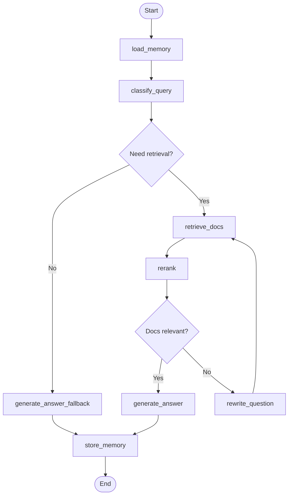

# University Admin RAG Chatbot

A RAG-based chatbot for answering university students' questions about general administration — powered by **LangGraph**, **Docling**, **Qdrant**, and **OpenRouter**.

## Architecture

```
┌─────────────────────────────────────────────────────────────┐
│  Serving Layer:  FastAPI  +  Redis (session store)          │
├─────────────────────────────────────────────────────────────┤
│  Agent Layer:    LangGraph  (classify → retrieve → rerank   │
│                  → generate)  +  OpenRouter LLM             │
├─────────────────────────────────────────────────────────────┤
│  Ingestion:      Docling  →  OpenRouter Embeddings  →       │
│                  Qdrant (admin_docs collection)              │
└─────────────────────────────────────────────────────────────┘
```

### Agent Flow



## Quick Start

### 1. Prerequisites

- Python 3.13+
- [uv](https://docs.astral.sh/uv/) package manager
- Docker & Docker Compose (for Qdrant + Redis)

### 2. Clone & Install

```bash
git clone <repo-url>
cd langgraph_agent_ai
uv sync
```

### 3. Configure Environment

```bash
cp .env.example .env
# Edit .env with your API keys:
#   OPENROUTER_API_KEY=sk-or-v1-...
#   JINA_API_KEY=jina_...
#   TELEGRAM_BOT_TOKEN=12345:ABC... (Optional, for Telegram bot)
```

### 4. Start Dependencies

```bash
docker compose up -d qdrant redis
```

### 5. Run the Server

```bash
uv run uvicorn app.main:app --reload
```

The API is available at **http://localhost:8000**

### Or Run Everything with Docker

```bash
docker compose up --build
```

## API Endpoints

| Method | Path                           | Description                                     |
|--------|--------------------------------|-------------------------------------------------|
| GET    | `/health`                      | Service health check (Qdrant+Redis)             |
| POST   | `/chat`                        | Send message, get answer                        |
| POST   | `/ingest`                      | Upload & process admin documents                |
| POST   | `/ingest/by-file/chunks`       | Add a new chunk manually                        |
| PATCH  | `/ingest/by-file/chunks`       | Update an existing chunk                        |
| DELETE | `/ingest/by-file/chunks`       | Delete a specific chunk                         |
| POST   | `/telegram/setup`              | Set up Telegram webhook                         |
| POST   | `/telegram/webhook/{secret}`   | Telegram webhook receiver (called by Telegram)  |
| POST   | `/telegram/teardown`           | Remove Telegram webhook                         |

### POST /ingest

```bash
curl -X POST http://localhost:8000/ingest \
  -F "file=@docs/sample.pdf"
```

### POST /chat

```bash
curl -X POST http://localhost:8000/chat \
  -H "Content-Type: application/json" \
  -d '{"session_id": "user-123", "message": "How do I register for next semester?"}'
```

### POST /telegram/setup

```bash
curl -X POST http://localhost:8000/telegram/setup \
  -H "Content-Type: application/json" \
  -d '{"webhook_url": "https://your-domain.com/telegram/webhook/your-secret"}'
```

## Project Structure

```
langgraph_agent_ai/
├── app/
│   ├── main.py              # FastAPI app, middleware, lifespan
│   ├── config.py            # Pydantic Settings
│   ├── api/                 # API endpoints & schemas
│   │   ├── models.py        # Request/response Pydantic models
│   │   └── routers/         # Route definitions
│   │       ├── auth.py      # Authentication routes
│   │       ├── health.py    # GET /health
│   │       ├── ingestion.py # Document processing & chunk CRUD
│   │       ├── chat.py      # POST /chat
│   │       └── telegram.py  # Telegram webhook integration
│   ├── agent/               # LangGraph Agent
│   │   ├── state.py         # AgentState definition
│   │   ├── graph.py         # StateGraph construction
│   │   └── nodes/           # Graph nodes
│   ├── services/            # Core services
│   │   ├── embeddings.py    # OpenRouter embeddings
│   │   ├── llm.py           # OpenRouter LLM
│   │   ├── vectorstore.py   # Qdrant client
│   │   ├── reranker.py      # Jina Reranker
│   │   └── memory.py        # Redis sessions
│   ├── ingestion/           # Document processing
│   │   ├── parser.py        # Docling parser
│   │   ├── chunker.py       # HybridChunker
│   │   ├── upserter.py      # Embed + upsert
│   │   └── pipeline.py      # Orchestrator
│   └── utils/               # Shared utilities
├── tests/                   # Unit tests
├── Dockerfile
├── docker-compose.yml
├── pyproject.toml
└── .env.example
```

## Tech Stack

| Component   | Technology                          |
|-------------|-------------------------------------|
| Framework   | FastAPI + Uvicorn                   |
| Agent       | LangGraph (StateGraph)              |
| LLM         | OpenRouter (deepseek/deepseek-v3.2) |
| Embeddings  | OpenRouter (qwen/qwen3-embedding-8b)|
| Reranker    | Jina Reranker v3                    |
| Vector DB   | Qdrant (cosine similarity)          |
| Sessions    | Redis (1h TTL)                      |
| Doc Parsing | Docling (HybridChunker)             |

## License

MIT
