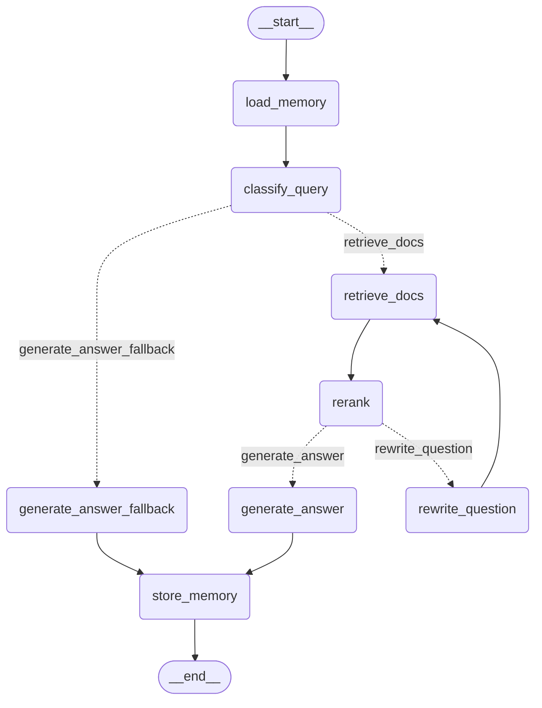

# LangGraph RAG Agent - Architecture & Code Structure

Berikut adalah penjelasan detail mengenai struktur direktori dan kode yang mengonstruksi **LangGraph** pada project ini.

## 📁 Struktur Direktori `app/agent/`

Keseluruhan logic agent RAG kita berada di dalam package `app/agent/`. Strukturnya diformat secara rapi dan dipisah berdasarkan concern (Node, State, Prompts, Graph).

```text
app/agent/
├── graph.py       -> File utama yang merangkai StateGraph (Edges & Routing)
├── state.py       -> Definisi `AgentState` (TypedDict) yang mengalir di setiap node
├── prompts.py     -> Menyimpan template prompt untuk LLM (Classify, Generate, Rewrite, dll)
└── nodes/         -> Berisi definisi fungsi-fungsi yang menjadi Node di dalam LangGraph
    ├── classify.py   -> Node untuk mengklasifikasi apakah query butuh retrieval atau tidak
    ├── generate.py   -> Node untuk mensintesis jawaban, fallback, dan merewrite pertanyaan
    ├── memory.py     -> Node untuk load dan store chat history
    ├── rerank.py     -> Node untuk me-rerank dokumen yang ditarik dari Vector DB
    └── retrieve.py   -> Node untuk menarik (retrieve) dokumen awal dari Vector DB (Qdrant)
```

---

## 🧩 Komponen Utama Kode

### 1. State Definition (`app/agent/state.py`)

Setiap state agent di LangGraph direpresentasikan dengan `AgentState` (sebuah `TypedDict`). State ini yang di-passing dan di-mutate oleh setiap node (layaknya passing pointer memory antar fungsi).

```python
class AgentState(TypedDict, total=False):
    query: str
    session_id: str
    chat_history: list[dict[str, Any]]
    need_retrieval: bool
    documents: list[dict[str, Any]]
    reranked_documents: list[dict[str, Any]]
    relevance_ok: bool
    rewrite_count: int
    answer: str
    sources: list[dict[str, Any]]
```
* **Routing flags**: `need_retrieval` (dipakai pasca-classify) dan `relevance_ok` (dipakai pasca-rerank).
* **Memory & I/O payloads**: `query`, `session_id`, `chat_history`, `answer`, `sources`.

### 2. Node Functions (`app/agent/nodes/`)

Setiap node adalah fungsi Python sederhana yang menerima `AgentState` (dict) dan mengembalikan `dict` (state yang di-update). Contoh peruntukannya:
- **`classify.py`**: Node `classify_query` mengecek intensi user (sapaan santai vs pertanyaan dokumen), lalu mengeset state `{"need_retrieval": True/False}`.
- **`retrieve.py`**: Node `retrieve_docs` memanggil service Qdrant Vector Store untuk menarik chunk bedasarkan dense vector, dan mengeset `{"documents": [...]}`.
- **`rerank.py`**: Node `rerank_docs` mengambil `documents`, me-rerank menggunakan model Cross-Encoder/Jina, mengevaluasi relevance threshold, dan mengeset `{"reranked_documents": [...], "relevance_ok": True/False}`.
- **`generate.py`**:
  - `generate_answer`: Jika dokumen relevan, format response RAG akhir.
  - `generate_answer_fallback`: Jika tidak butuh dokumen (sapaan santai), sapa balik lewat LLM chat.
  - `rewrite_question`: Minta LLM ubah/enrich query dan tambah state `rewrite_count += 1`.
- **`memory.py`**:
  - `load_memory`: Tarik dari Redis based on session_id masukin ke `chat_history`.
  - `store_memory`: Simpan interaksi (query dan answer) ke Redis Session.

### 3. Graph Routing & Edges (`app/agent/graph.py`)

File ini bertugas mengikat Nodes dan Router Logic dengan `StateGraph`. Router logic biasanya ditentukan oleh simple conditional functions, misalnya:

#### Contoh Router
```python
def route_after_classify(state: AgentState) -> str:
    """Route based on whether retrieval is needed."""
    if state.get("need_retrieval"):
        return "retrieve_docs"
    return "generate_answer_fallback"
```

#### Contoh Pendaftaran Graph
```python
def build_graph() -> StateGraph:
    graph = StateGraph(AgentState)

    # 1. Daftarkan Nodes
    graph.add_node("load_memory", load_memory)
    graph.add_node("classify_query", classify_query)
    graph.add_node("retrieve_docs", retrieve_docs)
    ...

    # 2. Definisikan Edges (Garis Graph Langsung)
    graph.add_edge(START, "load_memory")
    graph.add_edge("load_memory", "classify_query")

    # 3. Definisikan Conditional Edges (Garis Graph Bercabang)
    graph.add_conditional_edges(
        "classify_query",
        route_after_classify,
        {
            "retrieve_docs": "retrieve_docs",
            "generate_answer_fallback": "generate_answer_fallback",
        },
    )
    ...

    return graph.compile()
```

## 🔄 Alur Keseluruhan (Flow Graph)

Inilah representasi eksekusi dari kompilasi kode di `app/agent/graph.py`:



Struktur ini sudah modular, misal sewaktu-waktu kita butuh menambahkan node baru (e.g., node "web_search_fallback"), kita tinggal:
1. Buat class/fungsi nodenya di `/nodes/`.
2. Update TypedDict `AgentState` kalo butuh key baru.
3. Hook ke Edge beserta routernya di file `graph.py`.
